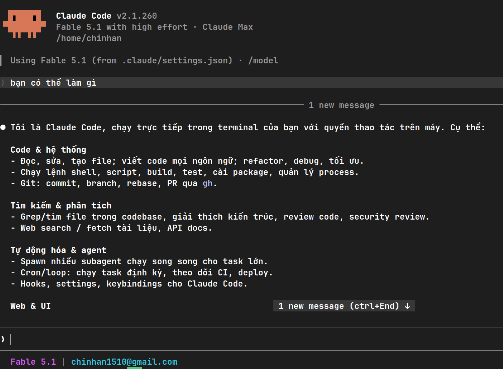

# AI Router Mini

> Cổng kết nối AI Router nội bộ dành cho Claude Code, Cursor, Codex... hỗ trợ định tuyến và tự động chuyển đổi tài khoản khi gặp giới hạn tần suất.

🌐 **Trang tài liệu trực tuyến (GitHub Pages):** [https://chinhanxt.github.io/Grok_Router-Mini/](https://chinhanxt.github.io/Grok_Router-Mini/)

---

<p align="center">
  
</p>

---

## Tổng quan dự án

Sử dụng AI Claude bằng Key, kết nối trực tiếp với Claude Code CLI và các công cụ lập trình AI. Hệ thống tự động quản lý, cân bằng tải và luân chuyển tài khoản ngầm khi gặp giới hạn tần suất.

---

## Hướng dẫn cài đặt & Khởi động

### Cách 1: Chạy trực tiếp (NPX)
```bash
npx ai-claude-keyapi
```
Tùy chọn chỉ định cổng:
```bash
npx ai-claude-keyapi --port 3006
```

### Cách 2: Cài đặt toàn cục (Global CLI)
```bash
npm install -g ai-claude-keyapi
ai-claude-keyapi
```

### Cách 3: Chạy từ mã nguồn
```bash
git clone https://github.com/chinhanxt/AI_Router-Mini.git
cd AI_Router-Mini
npm install
npm start
```

Web Dashboard: http://localhost:3005  
Tài khoản Admin mặc định: admin / admin123

---

## Kết nối với Claude Code (1-Click)

Khi router đang chạy, mở terminal mới và dán dòng lệnh tương ứng với hệ điều hành:

### macOS & Linux (Bash / Zsh)
```bash
curl -fsSL http://localhost:3005/claude.sh | bash
```

### Windows (PowerShell)
```powershell
irm http://localhost:3005/claude.ps1 | iex
```

### Windows (CMD)
```cmd
curl -fsSL http://localhost:3005/claude.cmd -o setup.cmd && setup.cmd
```

Lệnh trên sẽ tự động đặt biến môi trường và ghi cấu hình vào `~/.claude/settings.json`, sau đó khởi chạy Claude Code kết nối trực tiếp đến router.

---

## Các mô hình hỗ trợ

| Model ID | Mô hình | Mục đích sử dụng |
|---|---|---|
| `claude-sonnet-5` | Claude Sonnet 5 | Tối ưu tốt nhất giữa tốc độ và độ thông minh (Mặc định) |
| `claude-fable-5-1` | Claude Fable 5.1 | Suy luận cao cấp, lập trình tác nhân tự động lâu dài |
| `claude-opus-5` | Claude Opus 5 | Giải quyết bài toán lớn, kiến trúc hệ thống doanh nghiệp |
| `claude-haiku-4-5` | Claude Haiku 4.5 | Phản hồi siêu tốc, tác vụ phụ trợ |

---

## Giấy phép

Phát hành theo giấy phép MIT.
